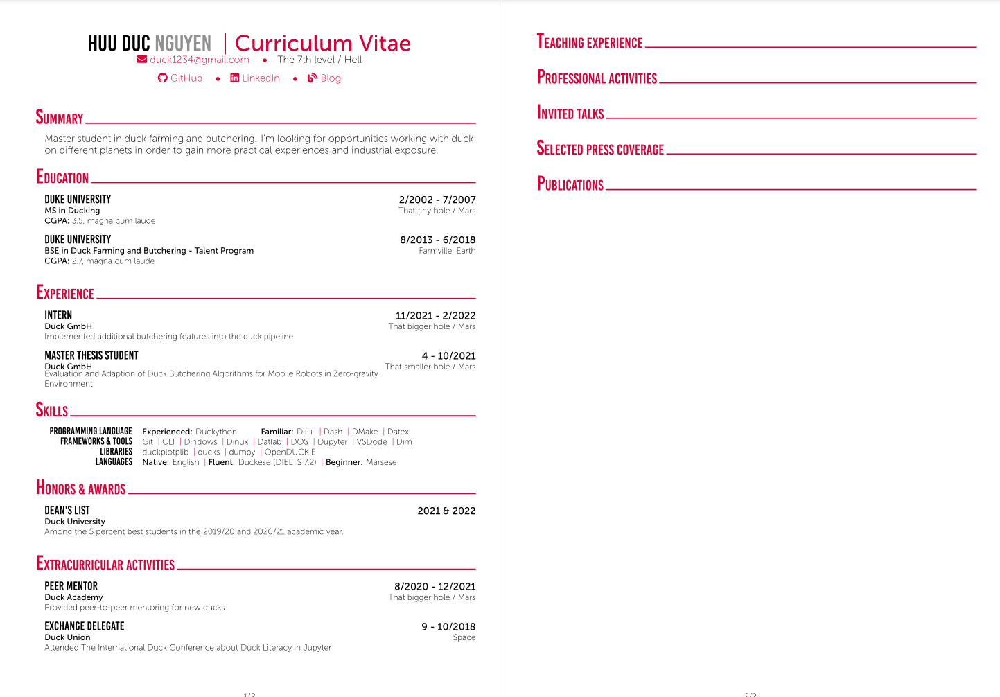

# Curriculum Vitae

- This CV is inspired by the design of [Awesome CV](https://github.com/posquit0/Awesome-CV).
- You can create your CV using [Overleaf's template](https://www.overleaf.com/latex/templates/curriculum-vitae-latex/jqztwqchhypk) or fork the repo.\
Play around with it and change however you see fit.

## How does it look?

